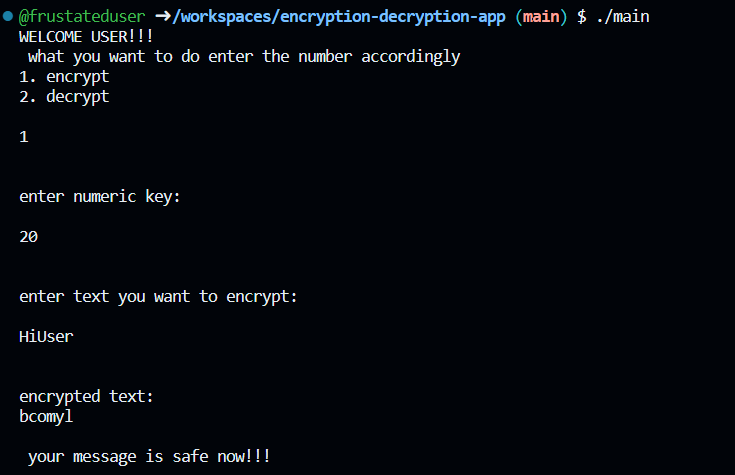
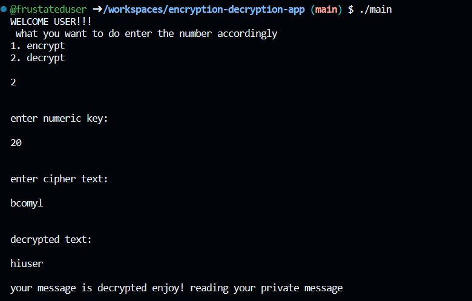

# Encryption-Decryption-App
This is a simple console based app for encryption🔐 and decryption🔓 using language c++

# Scope 

The app is console based and uses simple algorithms it will be further devloped using more complex algorithms
and higher level of encryption.

As encryption makes data and our message and privacy more secure it a very important aspect of data security.
Furthermore a GUI will be added making the app easy to use and comfortable for normal user,more implementations 
will be added in future your suggestions are welcome.

Here are some screenshort📷 of the app:
 
<figure>

<figcaption> encryption</figcaption>
</figure>

<figure>

<figcaption> decryption</figcaption>
</figure>